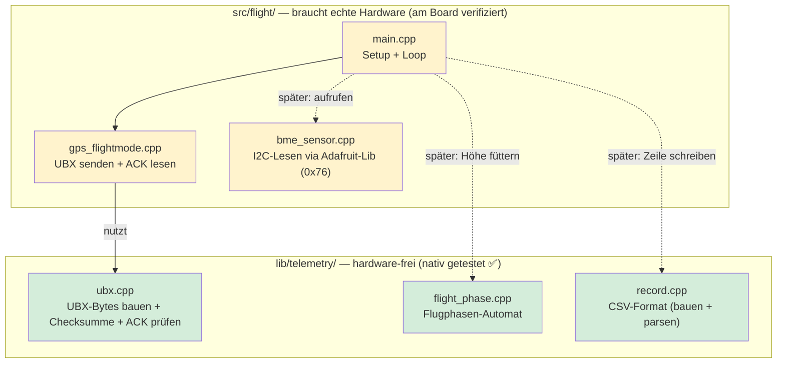
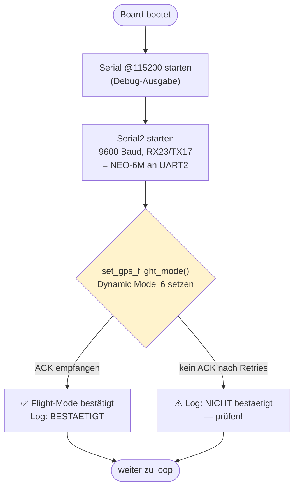
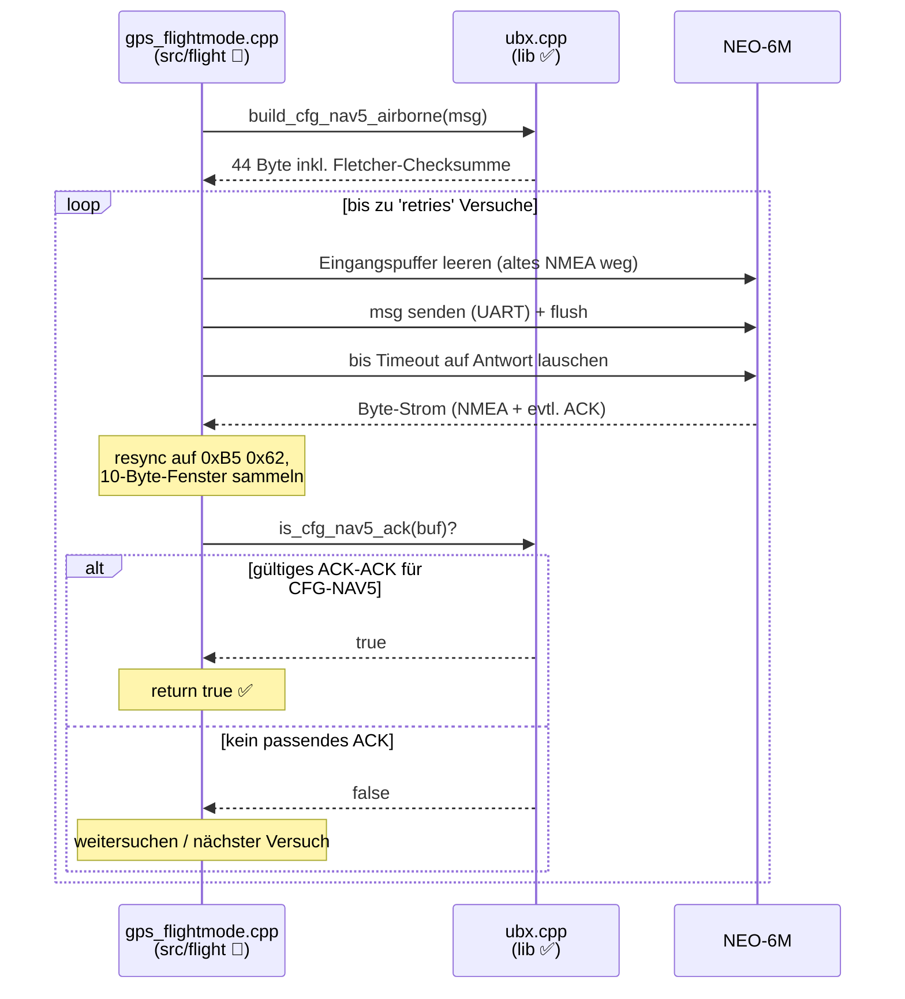
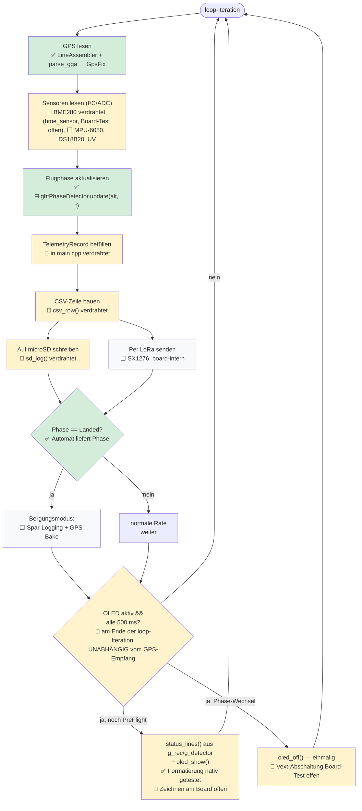
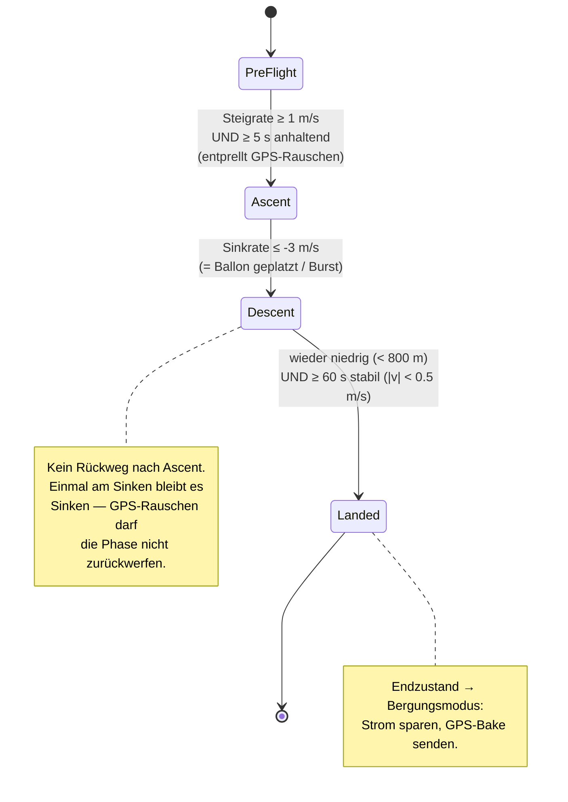
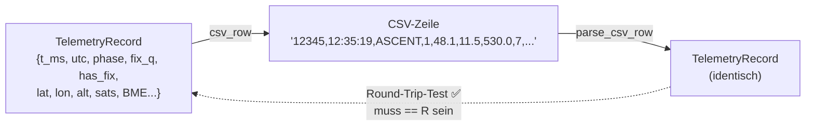

# Software-Flow — Wetterballon Flug-Einheit

Dieses Dokument erklärt den **Ablauf der Flug-Firmware**: welche Schritte in
welcher Reihenfolge passieren, *was* dabei geschieht und *warum*. Es beschreibt
den Ist-Stand des Codes und markiert klar, was schon implementiert ist und was
noch aussteht.

**Legende in den Diagrammen:**
`✅ fertig & nativ getestet` · `🔶 geschrieben, Board-Verifikation offen` · `⬜ noch nicht implementiert`

> **⚠️ Dieses Dokument mitpflegen!**
> Dieser Flow soll den *echten* Stand widerspiegeln. Nach **jeder** Änderung am
> Software-Ablauf (neuer Baustein, geänderter Übergang, Status von ⬜ → 🔶 → ✅)
> wird dieses Dokument **am Ende der Arbeit aktualisiert** — Diagramme, Status-
> Marker und die TODO-Landkarte in §6. Ein veraltetes Flow-Diagramm ist
> schlimmer als keines: Es täuscht einen Stand vor, den der Code nicht hat.

---

## 1. Überblick — Warum diese Architektur?

Der Kern-Grundsatz (siehe `CLAUDE.md`): **testbare Logik ist hardware-frei**.
Alles, was man auf dem Mac in Millisekunden testen kann, lebt in `lib/telemetry/`
(reines C++17, kein `<Arduino.h>`). Nur das, was echte Hardware *zwingend*
braucht (UART, I²C, SPI, Funk), lebt in `src/flight/`.

**Warum die Trennung?** Die fehleranfälligsten Teile — die exakte UBX-Byte-
Sequenz, die Landungserkennung, das CSV-Round-Trip — sind genau die, die man
am fliegenden Ballon *nicht* debuggen kann. Also werden sie vom Board entkoppelt
und gegen bekannt-korrekte Referenzen getestet.

---

## 2. Ablauf `setup()` — einmalig beim Boot

Das ist der Teil, der heute in `src/flight/main.cpp` implementiert ist. Der
kritischste Baustein steht bewusst ganz vorn: der GPS-Flight-Mode.

**Warum der Flight-Mode zwingend ist:** Der NEO-6M schaltet im Standard-Modus
oberhalb ~18 km die Positionsberechnung ab (CoCom-Grenze). Ohne „Airborne <1g"
(Modell 6) hätten wir also ausgerechnet in der interessanten Höhe **keine
Position** — und könnten den Ballon nicht mehr bergen. Deshalb wird das gleich
beim Boot gesetzt und per ACK verifiziert.

### 2a. Detail: Wie `set_gps_flight_mode()` das ACK absichert

Dieser Ablauf ist der Grund, warum die Byte-Logik separat (nativ) getestet wird —
hier steckt die meiste Fehlerquelle.

**Warum Puffer leeren + Resync?** Das GPS sendet permanent NMEA-Textzeilen. Das
kurze binäre ACK (beginnt mit `0xB5 0x62`) muss aus diesem Strom herausgefischt
werden — sonst „verdeckt" altes Geschwätz die Bestätigung. Der Resync-Automat
im Code sucht robust den Sync-Anfang, auch wenn mitten in einer NMEA-Zeile
begonnen wird.

---

## 3. Ablauf `loop()` — pro Messzyklus (Ziel-Architektur)

**Wichtig:** `loop()` ist inzwischen bis zur microSD verdrahtet (grün + gelb),
aber die gelben Knoten (🔶) sind **am Board noch nicht verifiziert** — nur der
Flight-Build ist geprüft (kompiliert fehlerfrei). Der folgende Ablauf zeigt, wo
die nativ getesteten Logik-Bausteine (grün) andocken, was verdrahtet, aber
board-unverifiziert ist (gelb), und was noch fehlt (weiß).

**OLED-Boden-Check (`status_lines()` + `oled_*`):** Der Display-Block läuft
**am Ende jeder `loop()`-Iteration**, bewusst **entkoppelt vom GPS-Empfang** —
also auch dann, wenn gerade keine GGA-Zeile ankommt. Das ist der Grund für die
Entkopplung: Ein *stummes* GPS-Modul (nicht verkabelt, defekt) muss als
`GPS: --` sichtbar werden — läge das Zeichnen hinter dem GGA-Parsing, bliebe
das Display genau in diesem Fehlerfall leer. Gedrosselt wird auf höchstens
einen Redraw alle 500 ms (`OLED_REFRESH_MS`), damit nicht jede Iteration aufs
I²C schreibt. Der Zustand kommt aus dem persistenten `g_rec`/`g_detector`
(nicht aus einem lokalen Fix). Solange die Phase `PreFlight` ist, zeigt das
Display fünf Zeilen (Titel, GPS-Stufe inkl. Satellitenzahl, SD-Status, Phase,
Sensorstatus) — der „Startklar?"-Check ohne Laptop am Startort. Die fünfte
Zeile fasst die vier Sensoren als Kurzcodes zusammen (`B:ok M:-- D:-- U:--` für
BME280/MPU-6050/DS18B20/UV) — `ok`, wenn das jeweilige `*_ok`-Flag im
`DisplayState` gesetzt ist, sonst `--`. `src/flight/main.cpp` befüllt inzwischen
`bme_ok` aus dem Ergebnis von `bme_begin()`; `mpu_ok`/`ds18b20_ok`/`uv_ok`
bleiben noch **unbefüllt** (⬜), bis die jeweilige Sensor-Anbindung steht. Beim ersten Übergang in
`Ascent` wird `oled_off()` über das `g_oled_active`-Flag genau einmal
aufgerufen (Vext + Display aus): am fliegenden Ballon ist ein aktives Display
unnötiger Stromverbrauch. Die Zeilen-Formatierung
(`lib/telemetry/display_status`) ist nativ getestet (✅); das tatsächliche
Zeichnen und die Vext-Abschaltung am echten SSD1306 sind noch **nicht am Board
verifiziert** (🔶) — Teil der TODO-Testreihenfolge.

**Warum EIN gemeinsames CSV-Format für SD *und* LoRa?** So sind das
Bord-Log (vollständig, auf SD) und das Empfangs-Log (lückenhaft, per Funk)
hinterher direkt Zeile für Zeile vergleichbar — man sieht z. B., welche
Telemetrie-Pakete unterwegs verloren gingen (Konzept §7.2).

---

## 4. Flugphasen-Automat — das sicherheitskritische Herzstück

`flight_phase.cpp` bekommt nur **Höhe + Zeit** und entscheidet daraus die Phase.
Bewusst als reiner Zustandsautomat gebaut, damit „Landung erkennen" ohne echten
Flug testbar ist.

**Warum Entprellen (die Zeitschwellen)?** Am Boden zappelt die GPS-Höhe um
mehrere Meter. Ein einzelner „Sprung" nach oben darf nicht sofort „Aufstieg"
auslösen (sonst startet das volle Logging zu früh), und ein einzelner Ausreißer
nach unten darf nicht „Landung" melden (sonst geht die Firmware fälschlich in
den Sparmodus, während der Ballon noch fliegt). Deshalb müssen die Bedingungen
über eine Mindestzeit *anhalten*.

**Warum keine Rücksprünge?** Die Übergänge sind bewusst als Einbahnstraße
modelliert (PreFlight → Ascent → Descent → Landed). Das macht das Verhalten
vorhersehbar und robust gegen Messrauschen — der teuerste Fehler wäre, den
Bergungsmodus zu verpassen, weil die Phase hin- und herspringt.

---

## 5. CSV-Record — die zentrale Datenschnittstelle

`record.cpp` baut aus einem `TelemetryRecord` eine CSV-Zeile und kann sie wieder
zurücklesen (`parse_csv_row`). Der **Round-Trip** (schreiben → parsen → gleicher
Record) ist die Testabsicherung.

**Warum leere Felder statt Nullwerte?** Fehlt der GPS-Fix, werden lat/lon/alt/sats
als **leere** CSV-Spalten geschrieben (`12345,,ASCENT,,,,`), nicht als `0`.
Grund: `0.0` wäre eine gültige Koordinate (Golf von Guinea) — ein leeres Feld ist
eindeutig „kein Wert" und wird in Excel/Python korrekt als NaN gelesen.

**Erweitern nach YAGNI (aus dem Header):** Ein neuer Sensor = genau drei Stellen —
Feld im Record, Spaltenname in `csv_header()`, Wert in `csv_row()` + Lesen in
`parse_csv_row()`. Die Spaltenreihenfolge muss in allen dreien identisch sein;
der Round-Trip-Test fängt jede Abweichung sofort.

**Warum eine eigene `fix_q`-Spalte?** Sie trägt die **rohe** GGA-Fix-Qualität
(Feld [6]: `0`=kein Fix, `1`=GPS, `2`=DGPS …) und steht direkt nach `phase`. Der
`parse_gga()` reduziert diesen Wert intern zwar auf `has_fix = (fix_q > 0)`, aber
für die Diagnose am Boden ist der Unterschied zwischen „nie ein Fix" und
„Fix verloren" wertvoll. Anders als die GPS-Positionsfelder wird `fix_q` **immer**
geschrieben (auch `0`), denn `0` ist hier ein echter Messwert, kein fehlender.

**Warum eine eigene `utc`-Spalte?** Sie trägt die absolute GPS-Uhrzeit als
`hh:mm:ss` (aus Feld [1] der GGA-Zeile) und steht bewusst **entkoppelt von
`has_fix`** — das GPS liefert oft schon eine gültige Uhrzeit, bevor ein
Positions-Fix steht; fehlt sie, bleibt das Feld leer (`has_utc=false`). Neben
dem monotonen, aber bei Neustart zurückspringenden `t_ms` steht damit eine
absolute, neustartfeste Zeit zur Verfügung — das macht einen `t_ms`-Rücksprung
harmlos und erlaubt den Abgleich von SD-Log, Empfangs-Log und Action-Cam über
die Uhrzeit.

**Warum ein gemeinsames `has_bme`-Flag für vier Spalten?** `temp_c`,
`pressure_hpa`, `alt_baro_m` und `humidity_pct` stammen aus demselben
BME280-Lesezyklus — fehlt der Sensor (nicht bestückt, I²C-Fehler), fehlen
zwangsläufig alle vier, also genügt ein gemeinsames Flag statt vier einzelner.
Anders als beim ursprünglich geplanten BMP280 übernimmt hier bewusst **nicht**
`lib/telemetry` die Umrechnung, sondern die Adafruit-BME280-Bibliothek direkt
in `src/flight/bme_sensor` — eine bewusste Abweichung von der sonstigen
Hardware-frei-Regel (siehe `docs/superpowers/specs/2026-07-05-bme280-umbau-design.md`).

**Warum vier einzelne `*_ok`-Flags in `DisplayState` statt eines CSV-Felds?**
Der Sensorstatus in der OLED-Zeile ist reine **Boden-Diagnose** („ist der
Sensor gerade ansprechbar?"), keine Telemetrie fürs CSV-Log — er gehört daher
zu `lib/telemetry/display_status`, nicht zu `record`. Vier einzelne `bool`s
(analog zu `sd_ok`) statt eines generischen Arrays, weil es bei genau vier
fest benannten Sensoren bleibt (YAGNI).

---

## 6. Was fehlt noch? (Landkarte zum TODO)

| Baustein | Ort | Status |
|---|---|---|
| GPS-Flight-Mode Byte-Logik | `lib/telemetry/ubx` | ✅ nativ getestet |
| GPS-Flight-Mode senden/ACK | `src/flight/gps_flightmode` | 🔶 geschrieben, Board-Test offen |
| Flugphasen-Automat | `lib/telemetry/flight_phase` | ✅ nativ getestet |
| CSV-Record (bauen/parsen) | `lib/telemetry/record` | ✅ nativ getestet |
| GPS-UTC-Spalte (hh:mm:ss) | `lib/telemetry/gga` + `record` | ✅ nativ getestet |
| NMEA-Parser (GPS-Rohdaten → Record) | `lib/telemetry/gga` | ✅ nativ getestet |
| NMEA-Zeilen-Assembler | `lib/telemetry/line_assembler` | ✅ nativ getestet |
| GPS-Pipeline in loop() | `src/flight/main.cpp` | 🔶 geschrieben, Board-Test offen |
| BME280-CSV-Spalten (temp_c, pressure_hpa, alt_baro_m, humidity_pct) | `lib/telemetry/record` | ✅ nativ getestet |
| BME280-I²C-Anbindung (Adafruit-Lib, in loop() verdrahtet) | `src/flight/bme_sensor` + `main.cpp` | 🔶 geschrieben, Board-Test offen |
| Sensor-Lesung MPU-6050, DS18B20, UV | `src/flight/` + Umrechnung in `lib/` | ⬜ |
| microSD-Logging | `src/flight/sd_log` | 🔶 geschrieben, Board-Test offen |
| OLED-Boden-Check: Zeilen-Formatierung (inkl. Sensorstatuszeile) | `lib/telemetry/display_status` | ✅ nativ getestet |
| OLED-Sensorstatus: main.cpp befüllt `*_ok`-Flags | `src/flight/main.cpp` | ⬜ |
| OLED-Boden-Check: Zeichnen/Abschalten + Integration | `src/flight/oled` + `main.cpp` | 🔶 geschrieben, Board-Test offen |
| LoRa-Telemetrie | `src/flight/` | ⬜ |
| Bergungsmodus | `src/flight/` | ⬜ |
| Watchdog / Robustheit | `src/flight/` | ⬜ |
| Bodenstation | `src/ground/` | ⬜ Platzhalter |

Der **NMEA-GGA-Parser** ist nun **fertig und nativ getestet** (16 Tests grün):
Er verwandelt eine GGA-Zeile in ein `GpsFix`-Struct mit den Feldern `{has_fix,
fix_quality, lat, lon, alt_gps_m, sats, has_utc, utc_h, utc_min, utc_s}`. Damit
ist die reine Logik-Seite (GPS → Record) lückenlos abgedeckt — inklusive der
GPS-Uhrzeit und der rohen Fix-Qualität (CSV-Spalte `fix_q`).

Der **NMEA-Zeilen-Assembler** (`LineAssembler`) ist ebenfalls **fertig und nativ
getestet**: Er nimmt den GPS-UART-Bytestrom entgegen und liefert komplette
Zeilen (CRLF-Behandlung, Fragmentierung, Overflow/Resync — 7 Tests grün).
Damit sind beide Bausteine der GPS→Record-Logik hardware-frei abgesichert.

Darauf aufbauend ist die **GPS-Pipeline in `loop()`** (`src/flight/main.cpp`)
jetzt verdrahtet: UART2-Bytes → `LineAssembler` → `parse_gga()` → `TelemetryRecord`
→ `FlightPhaseDetector` → `csv_row()` → Ausgabe auf Serial **und** Schreiben auf
microSD über den neuen Wrapper `src/flight/sd_log` (feste Datei `/flight.csv`,
Append, Header nur einmal). Der Flight-Build kompiliert fehlerfrei — das
Laufzeitverhalten ist aber **noch nicht am echten Board verifiziert** (🔶).
Das ist der erste Punkt der TODO-Testreihenfolge: GPS-Flight-Mode am Boden
prüfen und dabei jetzt zusätzlich die CSV-Ausgabe über Serial sowie den
Inhalt von `/flight.csv` kontrollieren.

Die **GPS-UTC-Spalte** (Zeitstempel aus dem GPS statt nur `millis()`) ist nun
**umgesetzt und nativ getestet**: `parse_gga()` liest die absolute Uhrzeit aus
Feld [1] der GGA-Zeile in `GpsFix` (`has_utc`, `utc_h/utc_min/utc_s`), entkoppelt
von `has_fix`; `record.cpp` schreibt sie als eigene CSV-Spalte `utc` im Format
`hh:mm:ss` direkt nach `t_ms` und liest sie im Round-Trip wieder zurück — siehe
`docs/superpowers/specs/2026-07-04-gps-pipeline-integration-design.md`,
Abschnitt „Zeit & Synchronisierung".

Der tatsächlich verbaute Sensor ist ein **BME280** (nicht der bisher
dokumentierte BMP280) — inklusive Luftfeuchtigkeit. Der Umbau ist umgesetzt:
`TelemetryRecord` trägt jetzt `has_bme` + die vier Spalten
`temp_c,pressure_hpa,alt_baro_m,humidity_pct` (CSV jetzt 12 statt 11 Spalten).
Anders als beim GPS/Flugphasen-Code wird die Sensor-Umrechnung hier **bewusst
nicht** hardware-frei nachgebaut, sondern über die fertige Adafruit-BME280-
Bibliothek gelesen (`src/flight/bme_sensor`, I2C-Adresse fest `0x76`, QNH fest
1013,25 hPa) — das alte, native `lib/telemetry/bmp280`-Modul wurde ersatzlos
gelöscht (Details und Begründung:
`docs/superpowers/specs/2026-07-05-bme280-umbau-design.md`). `main.cpp` ruft
`bme_begin()` in `setup()` und `bme_read()` pro GGA-Zeile in `loop()` auf; der
Flight-Build kompiliert fehlerfrei, das Laufzeitverhalten ist aber **noch
nicht am echten Board verifiziert** (🔶) — nächster Punkt der TODO-
Testreihenfolge.

Der nächste offene, rein testbare `lib`-Baustein sind die **MPU-6050-Rohwert-
Umrechnungen** (→ °/s und g).

Der **OLED-Boden-Check** zeigt jetzt zusätzlich eine **Sensorstatuszeile**
(`lib/telemetry/display_status`, fertig und nativ getestet, 9 Tests grün):
`DisplayState` trägt vier unabhängige `bool`-Flags (`bme_ok`, `mpu_ok`,
`ds18b20_ok`, `uv_ok`), `status_lines()` fasst sie als fünfte Zeile in
Kurzcodes zusammen (`B:ok M:-- D:-- U:--`) — siehe
`docs/superpowers/specs/2026-07-04-oled-sensorstatus-design.md`. `bme_ok` wird
jetzt in `src/flight/main.cpp` aus dem Rückgabewert von `bme_begin()` befüllt;
`mpu_ok`/`ds18b20_ok`/`uv_ok` bleiben fest `false`, bis die jeweiligen Sensoren
überhaupt gelesen werden (siehe §6, MPU-6050/DS18B20/UV weiterhin ⬜).
